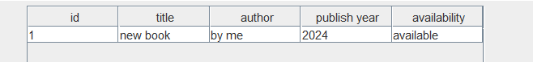
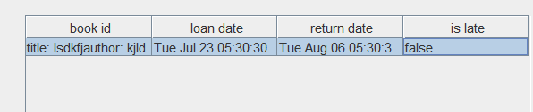

# design patterns:
* factory method 
  * for creating a book object
  * for creating a member object
* singleton
  * for creating a single instance of the library
* state
  * for keeping a state for the book
  * doing actions that are only allowed for that state
  * (change in the behavior of the book according to the state)
* prototype
  * used for copying a book object easily
* to be added:
  * observer
    * for updating the book model after change in library
    * for updating the librarian in any changes in book state
      * like a book that needs to be returned but the member is late
      * due date and so

# current state of the project (22/7/24)

### adding a new book

### editing a line in the table of books

### adding a copy via the edit

### removing the original via the edit

# book loan
* in order to loan a book
* i need to :
  * get the book object/id 
  * change the state of the book to borrowed
  * get the member id (the one who wants to get the book)
  * create a loan with the book id and the return date
  * add the loan to the member loan list
# book return
* in order to return a book
  * get the book id
  * change the state of the book to available
  * get the member that borrowed that book
  * remove the loan from the member loan list
  * change the loan status

# current app state last commit (23/7/24) 12:20am
- changed the ui classes to be more separated and readable
- added member panel (add, remove, see basic info about borrowed books, search)
- added some methods for book return and loan which are not yet used in the ui

# update 23/7/24 (5:17 am)

# update 5:30 am:
- fixed the is late error

- fixed the availability status not showing correctly

# to do
- add loans and late reports on the loan & return window
- change design a bit (Window locations, size of tables, check for an amount of data that is bigger than the table)
- add tests - load the data before app opens cause its a nightmare
- add the last pattern (4th)
- add javadoc for everything
- add update of book data (optional)
- on removal of a book, remove the loan from the member cause it doesn't matter no more